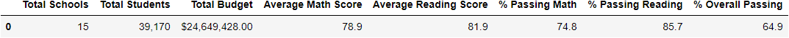
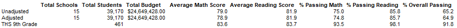
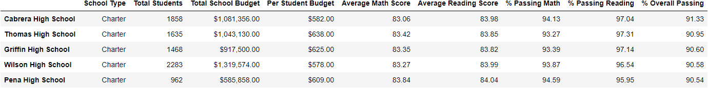
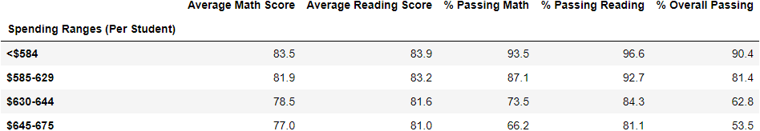
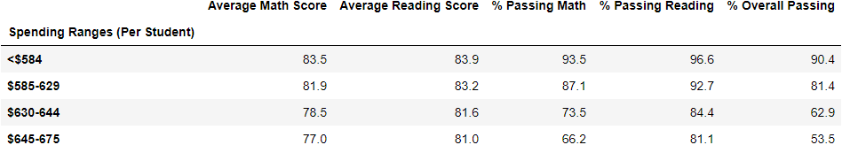
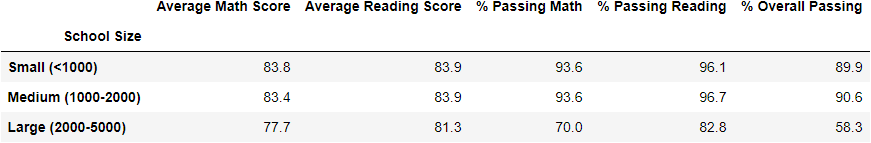
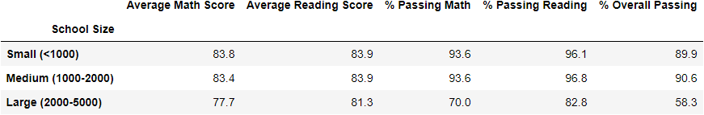
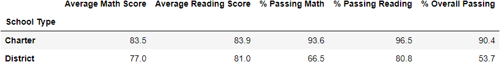

# School District Analysis
## Project Overview

The purpose of this analysis is to assist a City school system’s school board and superintendent make decisions regarding budgets and priorities.  To do so, this analysis will analyze data on student funding and student standardized test scores.

## Resources
- Data Source: students_complete.csv
                        schools_complete.csv
- Software : Python 3.8.9, Jupyter Notebook 6.1.4

## Results

[District Summary Unadjusted](analysis/107_district_summary.png
?raw=true "District Summary Unadjusted")

[District Summary Adjusted](analysis/26_district_summary_adjusted.png
?raw=true "District Summary Adjusted")

[District Summary Comparison](other_resources/01.District_Summary_Comparison.png?raw=true "District Summary Comparison")

- Total Students: 39,170
- Total Budget: $24,649,428.00
- Average Math Score
       Unadjusted: 79.0
       Adjusted: 78.9
- Average Reading Score:
      Unadjusted: 81.9
      Adjusted: 81.9
- % Passing Math:
       Unadjusted: 75.0
       Adjusted: 74.8
- % Passing Reading:
       Unadjusted: 85.8
       Adjusted: 85.7
- % Overall Passing:
        Unadjusted: 65.2
       Adjusted: 64.9

[Top 5 Schools Adjusted for THS](analysis/47_top5_adjusted_for_ths.png?raw=true " Top 5 Schools Adjusted ")

[Top 5 Schools Unadjusted](analysis/129_top5_schools.png?raw=true "Top 5 Schools Unadjusted")

The THS adjustment does not change THS’ placement within the top 5 schools, as the % Overall Passing remains just above Griffin High School on an adjusted basis.  Interestingly, the Average Reading score is the sole score that *rises* on an adjusted basis, indicating that the adjustment values were lower than the unadjusted values.  Other metrics, including Average Math Score, % Passing Math, % Passing Reading and % Passing overall were all lower on an adjusted basis, indicating that the impact grades were higher (or better) than the unadjusted values.

### School Spending Summary:

[Spending Summary Adjusted](analysis/62_spending_summary_adjusted_for_ths.png?raw=true "Spending Summary Adjusted ")

[Spending Summary Unadjusted](analysis/151_spending_summary.png?raw=true "Spending Summary Unadjusted")

The spending summary analysis changes within the $630-644 bucket, as that is the size range of the affected high school.  Specifically, % Passing Reading and % Overall passing both declined in the adjusted data, indicating that the affected rows were favorable compared to the overall averages.  The other metrics were unaffected at this precision level.

### School Size:

[School Size Adjusted](analysis/67_school_size_adjusted_for_ths.png?raw=true "School Size Adjusted")

[School Size Unadjusted](analysis/158_size_summary.png?raw=true "School Size Unadjusted")

School size adjustments are visible in the “Medium” category: again, because that is where the affected data resides.  In this case, only % Passing reading changes downward.

### School Type:

[Charter Summary Adjusted](analysis/71_charter_summary_adjusted_for_ths.png?raw=true " Charter Summary Adjusted")

[Charter Summary Unadjusted](analysis/162_charter_summary.png?raw=true "Charter Summary Unadjusted")

As in the prior two comparisons, the ‘Charter’ category changed with respect to the adjusted data as Thomas High School lies within this category.  The only metric that visibly changed at this precision is ‘% Passing Reading’, again downward indicating that the removed averages were superior to the aggregate averages.

## Summary

After the initial analysis was run, the school board discovered evidence of academic dishonesty in one grade of one of the district’s schools.  As such, the decision was made to replace the affected grade’s math and reading scores with NaN’s, effectively removing that school’s grade level from the district wide analysis.  In general, the district wide scores adjusted by the removal of the grade level data are lower, indicating that the affected grade’s scores were higher than district averages.  Total students data are unaffected at 39,170, as was the total budget at 
$24,649,428.00.  These metrics are not impacted by the dishonesty.  It should be noted that the impacted students numbered 461, but this is not shown in district summary statistics since they still impact per capita budget numbers.  Average Math Scores are lower on an adjusted basis, indicating that the affected schools’ values are higher.  This is also shown in the District summary comparison.  Average Reading Scores appear unaffected at this level of precision.  This simply indicates that the average scores in the affected grade were close to the district levels, but the conclusions remain the same.  % Passing Math, % Passing Reading, and % Overall Passing were all lower due to the significant outperformance of the affected grade.
